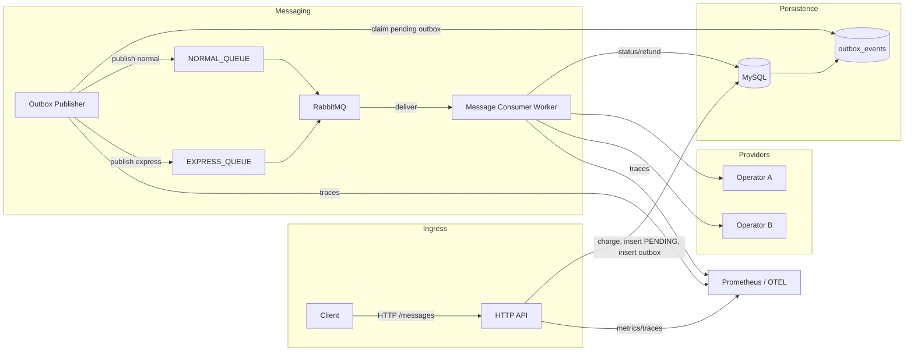
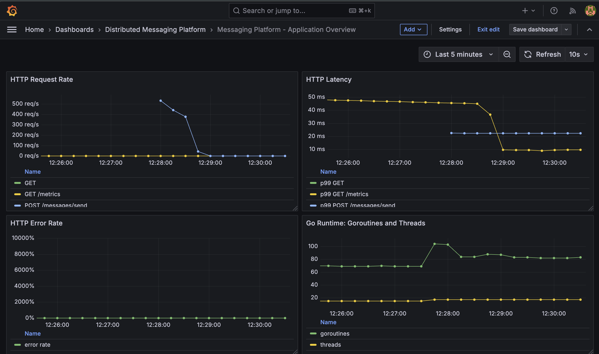
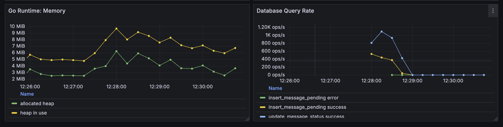
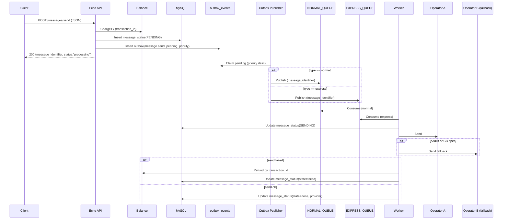
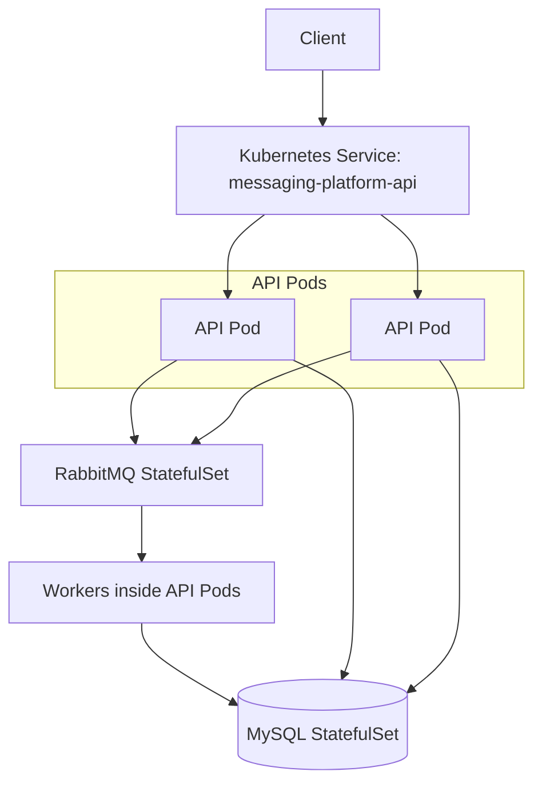
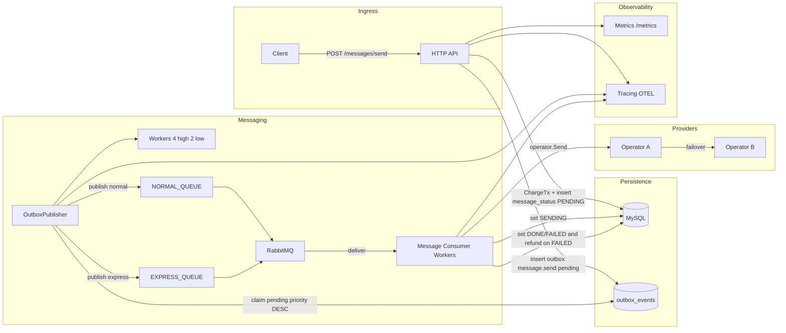

# distributed messaging platform – Developer Guide

[](https://github.com/arminazimi/distributed-messaging-platform/actions/workflows/ci.yml)

## Overview
- Full-stack observability: metrics for HTTP/DB/RabbitMQ, structured JSON logs, OpenTelemetry tracing.
- Robustness: graceful shutdown for server + workers, panic recovery middleware, balance refund on provider failure.
- Message flow: **Transactional outbox** for reliable publish, RabbitMQ for async delivery, MySQL for balance/transactions/history, operator failover with circuit breaker.

A distributed messaging platform that exposes HTTP APIs, manages user balance, writes message requests to an **outbox** (pending), publishes them to RabbitMQ via an outbox worker, processes delivery via operators with circuit breaker failover, and persists traces/metrics. Built with Go, Echo, MySQL, RabbitMQ, OpenTelemetry, and Prometheus-compatible metrics.

## Architecture
- API: Echo HTTP server (`cmd/api/main.go`) with JSON logging (slog), tracing middleware, metrics endpoint, and panic recovery.
- Balance: Reads/updates user balances and transactions (`internal/balance`).
- Messaging: Accepts send requests, debits balance, writes **message_status (PENDING)** + **outbox_events (pending)**, exposes history (`internal/message`).
- Outbox publisher: Polls `outbox_events` and publishes to RabbitMQ with priority worker pools (`internal/message/outbox_publisher.go`).
- Queue consumers: Consume Rabbit messages and call `sendMessage` (`internal/message/consumer.go`).
- Operators: Provider failover with circuit breaker (`internal/operator`, `pkg/circuitbreaker`).
- Observability: OpenTelemetry tracing (`pkg/tracing`), metrics (`pkg/metrics`), structured logs (`app.Logger`).

### High-level flow


### Components and responsibilities
- **`app/`**: Application bootstrap (config, logger, tracing, DB, Rabbit, Echo middlewares including recover).
- **`cmd/api/main.go`**: Route wiring, graceful shutdown, consumer start.
- **`internal/balance`**: Balance checks, deductions, refunds, history (transactions table).
- **`internal/message`**: Send handler, history query, worker `sendMessage` writes `message_status`, refunds on failure.
- **`internal/operator`**: Sends to OperatorA then fails over to B via circuit breaker.
- **`pkg/queue`**: Rabbit connection/publish/consumer setup.
- **`pkg/metrics`**: Echo middleware and Prometheus exposition.
- **`pkg/tracing`**: OpenTelemetry exporter init and helpers.

## Observability Stack
The local Docker Compose stack includes Prometheus, Grafana, Jaeger, and OpenTelemetry wiring for production-style visibility.

- **Prometheus** scrapes time-series metrics from the application at `/metrics` and from RabbitMQ at `:15692/metrics`. It stores request rates, latency histograms, Go runtime metrics, database query metrics, worker metrics, and RabbitMQ queue metrics.
- **Grafana** reads from Prometheus and visualizes the metrics through provisioned dashboards. The datasource and dashboards are loaded automatically from `observability/grafana/`.
- **OpenTelemetry** instruments request, worker, RabbitMQ, and operator flows with traces. The app exports traces through OTLP.
- **Jaeger** receives OpenTelemetry traces and provides trace search, span timelines, and request-flow debugging.

How they interact:
```text
Application /metrics ──scraped by──> Prometheus ──queried by──> Grafana
Application traces ──OTLP──> Jaeger
RabbitMQ metrics ──scraped by──> Prometheus ──queried by──> Grafana
```

Start the full observability stack:
```bash
docker compose up --build
```

Useful URLs:
- Grafana: `http://localhost:3000` (`admin` / `admin`)
- Prometheus: `http://localhost:9090`
- Jaeger: `http://localhost:16686`
- RabbitMQ Management: `http://localhost:15672` (`rabbit_user` / `rabbit_pass`)
- Application metrics: `http://localhost:8080/metrics`

Grafana dashboards are provisioned under the `Distributed Messaging Platform` folder:
- `Messaging Platform - Application Overview`: HTTP request rate, HTTP latency, error rate, Go runtime metrics, and database query rate.
- `Messaging Platform - RabbitMQ Overview`: queue depth, publish/delivery rate, connections/channels, and memory usage.

Verify metrics:
```bash
curl http://localhost:8080/metrics
curl http://localhost:9090/-/ready
curl http://localhost:15692/metrics
```

Recommended README screenshots:
- Grafana `Messaging Platform - Application Overview` dashboard after running `make benchmark`.
- Grafana `Messaging Platform - RabbitMQ Overview` dashboard while messages are being published/consumed.
- Prometheus **Status > Targets** page showing `messaging-platform-api` and `rabbitmq` as `UP`.
- Jaeger trace detail page for a `/messages/send` request.

Example Grafana dashboard captures:





For final portfolio screenshots, capture Grafana in view mode after clicking **Exit edit** so the dashboard panels are the focus.

## Performance Benchmark
This project includes a lightweight benchmark driver in `cmd/loadtest` for measuring the `/messages/send` ingestion path under concurrent HTTP traffic. The benchmark exercises the API layer, balance validation, message request persistence, and transactional outbox enqueue path while the service runs with MySQL and RabbitMQ in Docker Compose.

Start the stack:
```bash
docker compose up --build
```

In another terminal, seed test balances for the benchmark users:
```bash
make seed
```

The default seed command inserts balance directly into MySQL for users `1..5000`, which is faster and more repeatable than calling the balance API thousands of times. If you want to seed through the public HTTP API instead, use:
```bash
go run ./cmd/loadtest -seed-only -seed-method http -base-url http://localhost:8080 -seed-balance 100000 -users 5000
```

Run the benchmark:
```bash
make benchmark
```

The default benchmark sends traffic to `POST /messages/send` at `1000` requested RPS for `30s`, with `200` concurrent workers, `5000` rotating users, one recipient per request, and a `20%` express-message ratio. You can override these values without editing the Makefile:
```bash
BENCH_RPS=500 BENCH_CONCURRENCY=100 BENCH_DURATION=60s BENCH_USERS=5000 make benchmark
```

The benchmark measures API ingestion throughput, successful request processing, client-side errors, and latency percentiles for accepted message requests. These results help evaluate whether the service can sustain high write concurrency while preserving low tail latency across the database-backed outbox workflow.

| Target RPS | Achieved RPS | Concurrency | Duration | Total Requests | Successful Requests | Non-2xx Responses | HTTP Errors | Success Rate | p50 Latency | p90 Latency | p95 Latency | p99 Latency | Max Latency |
| --- | --- | --- | --- | --- | --- | --- | --- | --- | --- | --- | --- | --- | --- |
| 1000 | 995.3 | 200 | 30s | 29,860 | 29,856 | 0 | 4 | 99.987% | 4.33 ms | 8.21 ms | 11.26 ms | 26.02 ms | 84.97 ms |

The benchmark demonstrates that the platform can sustain approximately 1,000 requests per second with 99.98% successful request processing and sub-30ms p99 latency in a local Docker Compose environment.

## Routes
- **POST /messages/send**: Charge balance and **enqueue via outbox** (no direct Rabbit publish in handler).
  - Example:
    ```bash
    curl --location 'http://localhost:8080/messages/send' \
      --header 'Content-Type: application/json' \
      --data '{
        "customer_id": 1,
        "text": "hi",
        "recipients": [
          "09128582812",
          "091285284834"
        ],
        "type": "normal"
      }'
    ```
- **GET /messages/history**: Message status history with optional filters.
  - Example:
    ```bash
    curl --location 'localhost:8080/messages/history?user_id=1&status=pending&message_identifier=88636fb2-dd01-42a4-a718-1fe200683a45'
    ```
- **GET /balance**: Current balance + transactions.
  - Example:
    ```bash
    curl "http://localhost:8080/balance?user_id=1"
    ```
- **POST /balance/add**: Add balance and record transaction.
  - Example:
    ```bash
    curl -X POST http://localhost:8080/balance/add \
      -H 'Content-Type: application/json' \
      -d '{"user_id":1,"balance":100,"description":"top-up"}'
    ```
- **GET /swagger/***: Swagger UI (served by the API)
- **GET /metrics**: Prometheus metrics.
- **GET /healthz**: Liveness endpoint for process health.
- **GET /readyz**: Readiness endpoint for dependency health.

Routing by type: normal message → `NORMAL_QUEUE`; express message → `EXPRESS_QUEUE`.

Swagger UI default URL (adjust port to your `LISTEN_ADDR`): `http://localhost:8080/swagger/index.html`
- **Postman collection:** `postman/collections/Arvan.postman_collection.json`

## Health Checks
- **`GET /healthz`** returns `200 OK` with `{"status":"ok"}` when the application process is running. This is a liveness check: it answers whether the server itself is alive.
- **`GET /readyz`** returns `200 OK` only when required dependencies are reachable. It currently checks MySQL with `PingContext` and RabbitMQ by opening and closing a lightweight AMQP channel on the existing connection.

Examples:
```bash
curl http://localhost:8080/healthz
curl http://localhost:8080/readyz
```

These endpoints are useful for Docker Compose health checks and Kubernetes liveness/readiness probes.

## Message state machine
- **PENDING**: inserted during `/messages/send` (alongside outbox insert)
- **SENDING**: set by consumer right before calling `operator.Send`
- **DONE**: set on successful provider send
- **FAILED**: set on failure (and balance refund is applied)

State flow:

```
PENDING → SENDING → DONE
               ↘ FAILED
```

## Outbox priority + worker pools
- **Express** messages are inserted to outbox with higher `priority` (default: 10).
- **Normal** messages use lower priority (default: 0).
- The outbox publisher runs **4 workers for high priority** and **2 for low priority** and claims work with `FOR UPDATE SKIP LOCKED`.


## Data model (SQL)
```sql
CREATE TABLE user_balances (
    id BIGINT PRIMARY KEY AUTO_INCREMENT,
    user_id BIGINT NOT NULL UNIQUE,
    balance BIGINT NOT NULL DEFAULT 0,
    last_updated DATETIME NOT NULL DEFAULT CURRENT_TIMESTAMP ON UPDATE CURRENT_TIMESTAMP
) ENGINE=InnoDB;

CREATE TABLE user_transactions (
    id BIGINT PRIMARY KEY AUTO_INCREMENT,
    user_id BIGINT NOT NULL,
    amount BIGINT NOT NULL,
    transaction_type VARCHAR(50) NOT NULL,
    description TEXT,
    transaction_id VARCHAR(50) NOT NULL UNIQUE,
    created_at DATETIME NOT NULL DEFAULT CURRENT_TIMESTAMP,
    INDEX idx_user_transactions_user_id (user_id, created_at)
) ENGINE=InnoDB;

CREATE TABLE message_status (
    id BIGINT PRIMARY KEY AUTO_INCREMENT,
    user_id BIGINT NOT NULL,
    status VARCHAR(50) NOT NULL,
    type VARCHAR(50) NOT NULL,
    recipient VARCHAR(20) NOT NULL,
    provider VARCHAR(50) NOT NULL DEFAULT '',
    message_identifier VARCHAR(50) NOT NULL,
    created_at DATETIME NOT NULL DEFAULT CURRENT_TIMESTAMP,
    updated_at DATETIME NOT NULL DEFAULT CURRENT_TIMESTAMP ON UPDATE CURRENT_TIMESTAMP,
    UNIQUE KEY uq_message_status_identifier_recipient (message_identifier, recipient),
    INDEX idx_message_status_user_identifier (user_id, message_identifier),
    INDEX idx_message_status_user_status_created (user_id, status, created_at)
) ENGINE=InnoDB;

CREATE TABLE outbox_events (
    id BIGINT PRIMARY KEY AUTO_INCREMENT,
    aggregate_type VARCHAR(50) NOT NULL,
    aggregate_id VARCHAR(50) NOT NULL,
    event_type VARCHAR(100) NOT NULL,
    payload JSON NOT NULL,
    priority INT NOT NULL DEFAULT 0,
    status VARCHAR(20) NOT NULL DEFAULT 'pending',
    attempts INT NOT NULL DEFAULT 0,
    next_run_at DATETIME NULL,
    last_error TEXT NULL,
    created_at DATETIME NOT NULL DEFAULT CURRENT_TIMESTAMP,
    updated_at DATETIME NOT NULL DEFAULT CURRENT_TIMESTAMP ON UPDATE CURRENT_TIMESTAMP,
    UNIQUE KEY uq_outbox_aggregate_event (aggregate_id, event_type),
    INDEX idx_outbox_pending (status, priority, next_run_at, created_at)
) ENGINE=InnoDB;
```

## Request lifecycle: `/messages/send`


## Worker processing (simplified)
1. Outbox publisher claims `outbox_events` and publishes to Rabbit.
2. Consumer consumes from RabbitMQ queue.
3. Deserialize `model.Message`.
4. `sendMessage`: update `message_status` to **SENDING**, call `operator.Send` (A then B with circuit breaker), on failure mark **FAILED** + refund, on success mark **DONE** with provider.

## Circuit breaker + failover
- Implemented in `pkg/circuitbreaker` and used by `internal/operator.Send`.
- Attempts OperatorA first; on failure or open breaker, routes to OperatorB.


## Running locally
- Build: `make build`
- Run API: `make run`
- Tests: `make test`
- Lint: `make lint`
- Swagger docs: `make swag`
- Docker (app + deps): `make docker`
- Load test seed (fast DB seed): `make seed`
- Load test traffic: `make loadtest`
- Benchmark traffic: `make benchmark`

Or manually:
```bash
go run ./cmd/api
```

## Docker & Compose
- `Dockerfile` builds the Go service (see root).
- `docker-compose.yml` brings up MySQL, RabbitMQ, the app, Prometheus, Grafana, and Jaeger.
```bash
docker compose up --build
```
App listens on `:8080` by default; metrics at `/metrics`; swagger at `/swagger/index.html`; Grafana is available on `:3000`.

## Kubernetes Deployment
Kubernetes manifests are provided under `deploy/k8s/` as a simple production-oriented baseline without Helm. The setup runs the API as scalable pods, MySQL and RabbitMQ as single-replica StatefulSets with persistent volumes, and uses the existing `/healthz` and `/readyz` endpoints for pod health management.



### Kubernetes concepts used
- **Deployment** manages stateless API pods and keeps the requested number of replicas running.
- **Service** gives pods a stable DNS name and virtual IP. The API connects to MySQL with `mysql:3306` and RabbitMQ with `rabbitmq:5672`.
- **ConfigMap** stores non-sensitive configuration such as database host, queue names, exchange name, and connection pool settings.
- **Secret** stores sensitive values such as database passwords and the RabbitMQ connection URI. Commit only the template, not real production secrets.
- **Liveness Probe** calls `/healthz` to confirm the process is alive. If it fails repeatedly, Kubernetes restarts the container.
- **Readiness Probe** calls `/readyz` to confirm MySQL and RabbitMQ are reachable. If it fails, Kubernetes stops routing traffic to that pod until dependencies recover.
- **StatefulSet** manages stateful services that need stable storage and stable network identity, which fits MySQL and RabbitMQ better than a plain Deployment.

### Environment variables
The Kubernetes manifests reuse the same runtime variables as Docker Compose:

| Variable | Source | Purpose |
| --- | --- | --- |
| `LISTEN_ADDR` | ConfigMap | API bind address, set to `:8080`. |
| `DB_HOST`, `DB_PORT`, `DB_NAME`, `DB_USER_NAME` | ConfigMap | MySQL service discovery and database identity. |
| `DB_PASSWORD` | Secret | MySQL application user password. |
| `RABBIT_URI` | Secret | RabbitMQ AMQP connection string. |
| `RABBIT_MESSAGE_EXCHANGE`, `EXPRESS_QUEUE`, `NORMAL_QUEUE` | ConfigMap | RabbitMQ exchange and queue names. |
| `DB_MAX_OPEN_CONNS`, `DB_MAX_IDLE_CONNS`, `DB_CONN_MAX_LIFETIME_SEC` | ConfigMap | Database pool tuning for high-throughput workloads. |
| `OTEL_EXPORTER_OTLP_ENDPOINT`, `OTEL_EXPORTER_OTLP_INSECURE` | ConfigMap | OpenTelemetry exporter configuration. |

### Apply locally
Build the image that the API Deployment references:

```bash
docker build -t distributed-messaging-platform:latest .
```

If you use `kind`, load the image into the local cluster:

```bash
kind load docker-image distributed-messaging-platform:latest
```

If you use Minikube, build the image inside Minikube's Docker environment or load it:

```bash
minikube image load distributed-messaging-platform:latest
```

Create a local Secret from the template, then apply the manifests:

```bash
cp deploy/k8s/secret.template.yaml /tmp/messaging-platform-secret.yaml
kubectl apply -f deploy/k8s/namespace.yaml
kubectl apply -f /tmp/messaging-platform-secret.yaml
kubectl apply -f deploy/k8s/configmap.yaml
kubectl apply -f deploy/k8s/mysql-service.yaml
kubectl apply -f deploy/k8s/mysql-statefulset.yaml
kubectl apply -f deploy/k8s/rabbitmq-service.yaml
kubectl apply -f deploy/k8s/rabbitmq-statefulset.yaml
kubectl apply -f deploy/k8s/api-service.yaml
kubectl apply -f deploy/k8s/api-deployment.yaml
```

Check rollout status:

```bash
kubectl get pods -n distributed-messaging-platform
kubectl get svc -n distributed-messaging-platform
kubectl rollout status deployment/messaging-platform-api -n distributed-messaging-platform
```

Access the API from your machine:

```bash
kubectl port-forward svc/messaging-platform-api 8080:8080 -n distributed-messaging-platform
curl http://localhost:8080/healthz
curl http://localhost:8080/readyz
```

For RabbitMQ Management UI:

```bash
kubectl port-forward svc/rabbitmq 15672:15672 -n distributed-messaging-platform
```

Then open `http://localhost:15672` and log in with the credentials from your local Secret.

Suggested README screenshots:
- `kubectl get pods -n distributed-messaging-platform` showing API, MySQL, and RabbitMQ pods running.
- `kubectl rollout status deployment/messaging-platform-api -n distributed-messaging-platform`.
- Successful `curl http://localhost:8080/healthz` and `curl http://localhost:8080/readyz` responses through port-forwarding.
- RabbitMQ Management UI showing the provisioned queues.

## Capacity knobs
DB connection pooling can be tuned via env:
- `DB_MAX_OPEN_CONNS` (default 50)
- `DB_MAX_IDLE_CONNS` (default 25)
- `DB_CONN_MAX_LIFETIME_SEC` (default 300)


## Observability
- **Logs**: Structured JSON via slog to stdout.
- **Metrics**: Prometheus scrapes application and RabbitMQ metrics.
- **Dashboards**: Grafana dashboards are provisioned from `observability/grafana/`.
- **Tracing**: OpenTelemetry exporter sends traces to Jaeger; spans include user_id where available.

## Error handling
- Echo recover middleware guards panics.
- Domain errors bubble via handlers to appropriate HTTP codes (payment required for insufficient balance).
- Worker refunds balance on provider failure.

## Testing
- Unit/integration tests use `testcontainers` for MySQL/Rabbit in `testutil/`.
- Balance and messaging logic covered under `internal/.../*_test.go`.
- Run: `go test ./...`

## Diagrams (service context)

